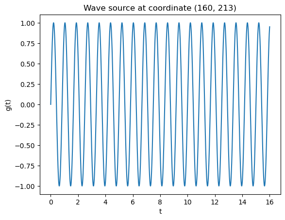
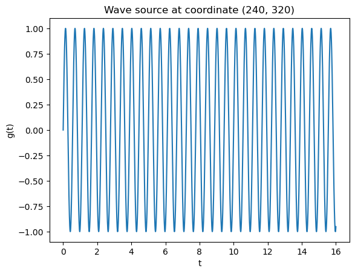
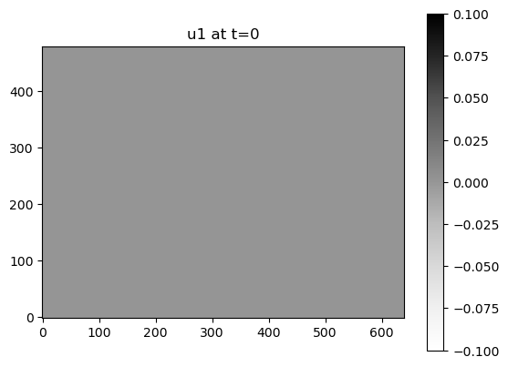
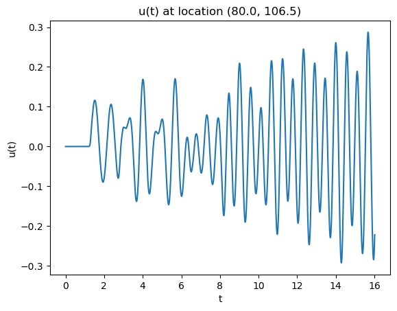
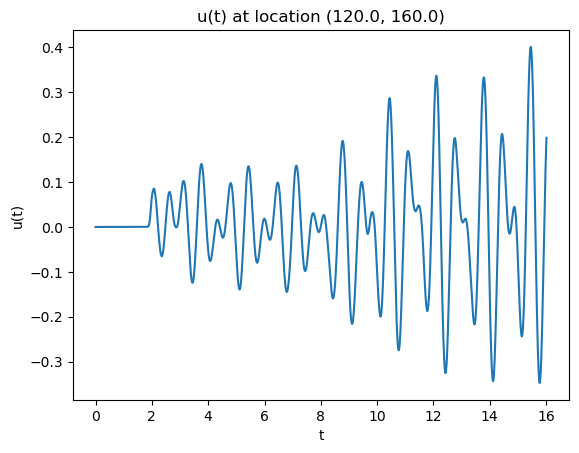
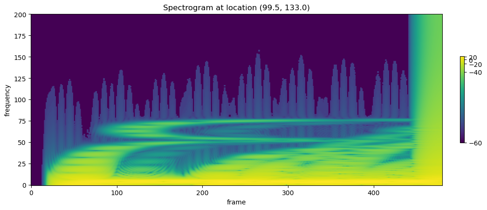
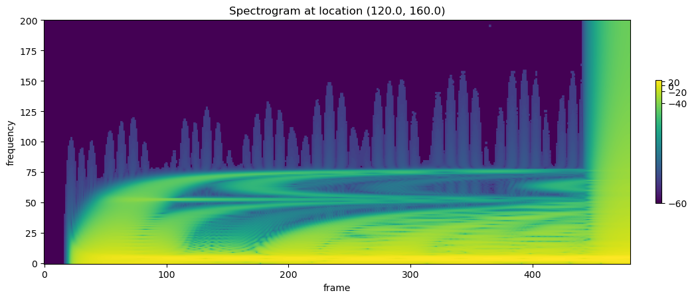

# Parallelized Wave Simulation Engine


*Two wave sources propagating in my simulation engine*

See <a href="https://github.com/gaoadam/wave-simulation">GitHub repo</a> for source code.


[Link to YouTube video of wave simulation](https://www.youtube.com/watch?v=UeoU4GUTFsk)

## Background

Proper testing of signal processing methods require rich datasets. But publicly available data sources are difficult to find.

Imagine you're trying to develop a lidar processing algorithm for some sort of image recognition app. Most likely, your test data will either be gathered from your own physical sensors, or from some public datasets.

Certainly, there are labeled image banks that can help with image recognition algorithms. However, they are generally limited in customization and devoid of real world signal complexities necessary for algorithm testing. Many methods of data collection also require significant financial and/or time investment.

In my own frustrations, I decided to generate my own data within a flexible but well-defined simulation engine. This would help me test different signal processing methods in a controlled manner.

So what exactly are the uses of a 2d wave simulation engine like mine?


*Photo credit: Johannes Plenio*

Optics, fluid mechanics, and sound involve all kinds of engineering oriented around multiple dimensions. Applications range from the study of materials to acoustical engineering. A 2 dimensional simulation allows for the study of interference patterns common to these situations.

Furthermore, the complexities of real world engineering are why a wave propagation simulation may be more useful than just simply plotting a wave as a function of time and space. One cannot reasonably predict a wave's behavior in the real world with only a set of analytical functions.

Ultimately, tunable parameters in a simulation may account for perturbations akin to real world phenomena. This allows users to observe how baseline signal processing results look given known constraints, and compare that phenomena to the messy real world.

## Parallel Computing for Wave Propagation

At the heart of my wave simulation module is how a wave moves through space over time. Imagine we are trying to simulate a wave moving through a sheet of paper. There are sets of information that the simulation uses:

* How high or low the sheet of paper is in different locations (ie wave amplitude)
* The properties of the paper itself (density, material etc) which determine the general speed of wave travel

I used the classic "wave equation" in 2 dimensions to simulate wave behavior:

$$\dfrac{\partial^2 u}{\partial t^2} = c^2\dfrac{\partial^2 u}{\partial x^2}$$

If you're unfamiliar with the notation, just know the equation indicates how a wave travels through some sort of medium over time and through space.

Assuming linear CPU computing, the addition of each new dimension effectively multiplies the compute time. This is why parallel processing in a GPU is highly recommended. Fortunately, key computations on my simulation module can be run directly on any NVIDIA GPU with CUDA support.

Given time $$t$$ and time step $$dt$$, if wavefunction $$u(x,y,t)$$ is known, then wavefunction $$u(x,y,t + dt)$$ can be calculated at each coordinate $$(x,y)$$ in parallel (simultaneously).

Thus, dimensions $$x$$ and $$y$$ can be parallelized while $$t$$ cannot be parallelized. Similarly predictive simulations with wavefunctions undefined by analytical functions are parallelizable across spatial coordinates, but not across time.

## Wave Source Customization

A large concern when it comes to simulation engines is not just realism or complexity, but how specific it can be to a given situation. For wave simulations, this concerns the wave sources themselves.

Wave sources in the real world can be approximated to all kinds of functions. For example, consider the effects of an earthquake on a closed room. One may want to approximate the wave source as a sum of the following:

* An impulse response (e.g. a sudden 30 millisecond impact)
* A constant sine wave with a specific frequency (e.g. a 300 Hz vibration)
* White noise

My wave simulator allows the user to add any number of wave source(s) with the following criteria:

* Wave source location via coordinates $$(x,y)$$
* Wave source amplitude at any time in the form of a function $$g(t)$$

For example, a user could simulate:

* The interaction between sine waves of different frequencies at different locations
* The interaction between a pulse and a wave source of multiple harmonics

It is often beneficial in scientific programming to allow the passing of a function into another function (e.g. least squares regression of a mathematical function). In more formal terms, this is the "passing of functions as arguments". I do this in my framework.

## Code Demo:

### PyTorch Tensor Settings

Tensor objects in the Pytorch library can be stored in a CUDA compatible CPU or GPU. We want to set the default storage to GPU so that parallel computing is leveraged where possible:

```
#Set the default torch tensor storage to GPU, if CUDA compatible GPU is available
if torch.cuda.is_available():  
  dev = "cuda:0" 
else:  
  dev = "cpu"  
device = torch.device(dev)  
print(dev)
```

Next, set the default tensor type to float:

```
torch.set_default_tensor_type('torch.cuda.FloatTensor')
```

## Prepare the wave medium

In initializing the wave simulation, different parameters must be set. This includes the physical dimension measurements of the simulation, step values (i.e. spatial and time resolution), and the wave propagation constant:

```
#Set dimensions of simulation
N_x=480
N_y=640
N_t=2400
#Set discrete time step values
dx=0.5
dy=0.5
dt=0.2/30
#Set wave propagation constant
c=30
```

Then we prepare a grid of x and y coordinate values. This is what will be used to calculate the wavefunction at different location coordinates:

```
#Create meshgrid to calculate wave function
r_space = wavetorch.get_r_space(N_x=N_x, N_y=N_y, dx=dx, dy=dy)
```

Then, we store the wavefunction metadata in a dictionary:

```
#Pack wave metadata into dictionary
u_meta = {'dx':dx,
          'dy':dy,
          'dt':dt,
          'c':c,
          'N_t':N_t}
```

### Prepare Wave Sources

My module allows for the user to customize wave sources as functions of time. First, create a list of dictionaries. The first key, 'coordinate', is the location of the wave source, in the form of indices. The second key, 'function', is any mathematical function that can be represented as a Python function.

In the following example, I elect to place a sine wave at 1.2 Hz at 1/3 border lengths from the bottom left, and a sine wave at 1.8 Hz at 1/2 border lengths from the bottom left:

```
#Create list of function nodes
g_r1 = [{'coordinate':(int(N_x/3),int(N_y/3)), 'function':(lambda t: np.sin(2.4*np.pi*t))},
        {'coordinate':(int(N_x/2),int(N_y/2)), 'function':(lambda t: np.sin(3.6*np.pi*t))}]
```

Next, plot the wave sources. Observe simple sine waves as expected:

```
#Plot g functions
for g in g_r1:
    t_temp = np.linspace(0, N_t*dt, N_t+1)
    plt.figure()
    plt.plot(t_temp, g['function'](t_temp))
    plt.xlabel('t')
    plt.ylabel('g(t)')
    plt.title('Wave source at coordinate {}'.format(str(g['coordinate'])))
```





### Generate Waves 

Finally, the fun part! Let's define the wave function at time = 0 for all locations in the grid. In this case, I define it as a flat plane, ie $$u(x,y) = 0$$ at $$t=0$$, for all $$x$$ and $$y$$.

This leads to a boring grey plot. But things are about to get interesting!

~~~
#Generate wave function value at time t = 0
#Wave function u is 0 at all values
u1_t0 = torch.zeros((N_x,N_y)).to(device)
#Plot wave function at t = 0
plt.figure()
plt.imshow(u1_t0.cpu().numpy(), cmap=cm.get_cmap(name='Greys'), origin='lower')
plt.colorbar()
plt.title('u1 at t=0')
~~~



With the setup done, generating simulation data is as simple as calling the wave_eq() function in one line of code. We pass in 3 arguments: initial wavefunction $$u(x,y)$$ at $$t=0$$ , the wave source functions, and the simulation metadata.

All the other lines of code seen below are to track code runtime:

```
#Set timer to get run time
st = time.time()

#Call wave simulation function and store results as object
data1 = wavetorch.wave_eq(u1_t0, g_r1, u_meta)
#end timer
et = time.time()

#Print elapsed time
elapsed_time = et - st
print('Execution time:', elapsed_time, 'seconds')
```

GPU run time is much faster than CPU-only run time.

### Observe Simulation Results

**Save to Video:**

One very simple and fun way to observe the simulation is by video. In my case, I elect to save the 3 dimensional tensor data to an mp4 video file. The first dimension is time, which determines the frame being shown on screen. The 2nd and 3rd dimensions are the coordinates of the pixels being shown:

```
#Get maximum wave amplitude to normalize pixel values in video
value_max = data1['u'].max().item()
#Write to video file
name_mpr1 = 'data1.mp4'
imageio.mimwrite(path_save+name_mpr1, (255*((data1['u'].cpu()+value_max)/value_max)/2).type(torch.uint8), fps = 1/dt,
                format='mp4')
```


**Save Raw Simulation Data**

Let's save the data as a raw tensor torch. This way we can re-open it in the future and manipulate it in any way we choose.

```
#Configure save paths
save_folder = "2023 04 11 Two Waves"
path_save = "{}\\{}\\".format(str(Path.cwd()), save_folder)

#Save to numpy array object
name_file1 = 'data1'
np.save(path_save+name_file1, data1['u'].cpu())
```

**Plots at different coordinates**

We can observe the raw signal (wave amplitude) at different coordinates in the simulation grid. First, let's open the raw simulation data we just saved:

```
#Configure open paths
open_folder = "2023 04 11 Two Waves"
open_path = "{}\\{}\\".format(str(Path.cwd()), open_folder)

#Open wave simulation metadata
with open(open_path+'data1 metadata.json') as f:
    u_metadata=json.load(f)
    
#Open numpy array to torch tensor
u_tensor = torch.load(open_path + 'data1.pt')

#Get dimensions
N_t = u_tensor.shape[0]
N_x = u_tensor.shape[1]
N_y = u_tensor.shape[2]
t_array = np.linspace(0, N_t*u_metadata['dt'], N_t)
```

The beauty of tensor indices is that pinpointing and extracting data is quite simple. 

```
#Extract the simulation signal at different locations using a list of coordinates
for coordinate in [(int((1/3+1/2)/2*N_x), int((1/3+1/2)/2*N_y)),
                   (int((1/3)*N_x), int((1/3)*N_y)),
                    (int((1/2)*N_x), int((1/2)*N_y))]:

    #Extract signal
    u1_loc1 = u_tensor[:,coordinate[0], coordinate[1]]
    #Plot signal
    plt.figure()
    plt.plot(t_array, u1_loc1.cpu().numpy())
    plt.xlabel('t')
    plt.ylabel('u(t)')
    plt.title('u(t) at location ({}, {})'.format(u_metadata['dx']*coordinate[0],
                                               u_metadata['dy']*coordinate[1]))
```






**Spectrograms at different coordinates**

Spectrograms are image like plots that show the frequency makeup of a signal over time. Spectrograms are extremely useful for analyzing properties of signals in the frequency domain. This in turn can be used to identify or categorize sources of the signal.

```
#Initialize Spectrogram
transform = torchaudio.transforms.Spectrogram(n_fft=400, hop_length=5)

#Extract the simulation signal at different locations using a list of coordinates
for coordinate in [(int((1/3+1/2)/2*N_x), int((1/3+1/2)/2*N_y)),
                   (int((1/3)*N_x), int((1/3)*N_y)),
                    (int((1/2)*N_x), int((1/2)*N_y))]:

    #Extract signal
    u_loc = u_tensor[:,coordinate[0], coordinate[1]] 
    #Get Spectrogram
    spectrogram = transform(u_loc.cpu())
    #log shift factor to avoid getting log(0) in power transform
    log_shift = 1e-5
    # Get the power spectral density shifted by a factor
    spectrogram_power = 10 * np.log10(spectrogram.cpu()+log_shift)
    
    #Initialize plot
    plt.figure(figsize=(12,10))
    #Plot only the lower frequencies of the spectrogram
    im = plt.imshow(spectrogram_power.type(torch.double).cpu(), origin="lower", norm=colors.PowerNorm(gamma=0.1))
    plt.colorbar(im, fraction=0.01, pad=0.04)
    plt.xlabel('frame')
    plt.ylabel('frequency')
    plt.title('Spectrogram at location ({}, {})'.format(u_metadata['dx']*coordinate[0],
                                               u_metadata['dy']*coordinate[1]))
```







Note the y axes correspond to the frequency, the x axes correspond to time, and the color indicates the amplitude of the specific frequency.

## Under the Hood:

The use of torch tensors is no trivial matter! By doing so, we are able to add and subtract numbers between tensor objects in parallel, instead of iteratively.

I won't go too in depth on how I constructed the source code for general simulations, but I will describe some sample lines of code.

**Adding wavefunction values from previous times**

Note the following tensor names used in the module:

* u is $$u(t)$$ at the current timestep $$t$$
* u_prev1 is $$u(t)$$ at previous timestep $$t-dt$$
* u_new is $$u(t)$$ at future timestep $$t+dt$$. We are trying to calculate this value

Take the following excerpt:

```
#Given no boundary condition constraints
    if boundary == "None":
        
        #Unsqueeze tensors
        u=u.unsqueeze(dim=2)
        u_prev1 = u_prev1.unsqueeze(dim=2)
        
        #Ensure shape of u is equal to shape of u_prev
        u_new = torch.zeros(size=u.shape)
        
        #Iterate through each x and y coordinate of u to calculate next u step
        #Add u_prev1
        u_new[1:u.shape[0]-1,1:u.shape[1]-1] = u_new[1:u.shape[0]-1,1:u.shape[1]-1].clone().index_add_(dim=0,
            index=torch.arange(0,u.shape[0]-2),
            source=u_prev1[1:u.shape[0]-1, 1:u.shape[1]-1],
            alpha=-1)
```

In order to calculate u_new, we must add the values of u_prev1 and u at different coordinates. This is done using the index_add_ function from torch, which allows parallelized addition from u_prev1 and u, onto u_new.

What's amazing about this function is that it utilizes the power of indexing relative coordinates. This allows us to specify which coordinate from the previous wavefunction to add to the current wavefunction.

This is the reason we are able to parallelize the wave simulation with torch. Predicting the wave amplitude at coordinate (x,y) in future time not only requires knowledge of what the amplitude at (x,y) looks like at previous time. It also requires knowledge of surrounding coordinates (x+dx,y) (x-dx,y) etc at previous time.
